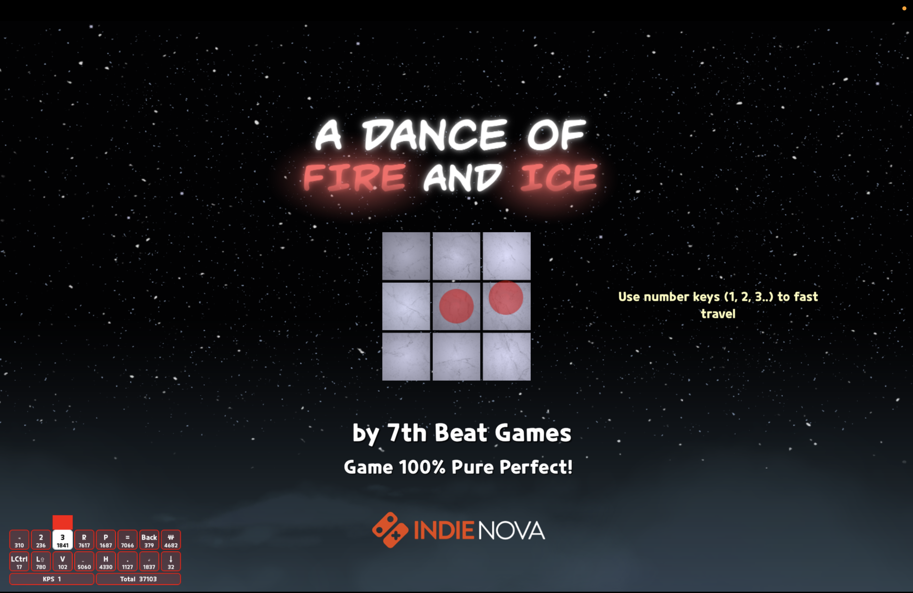
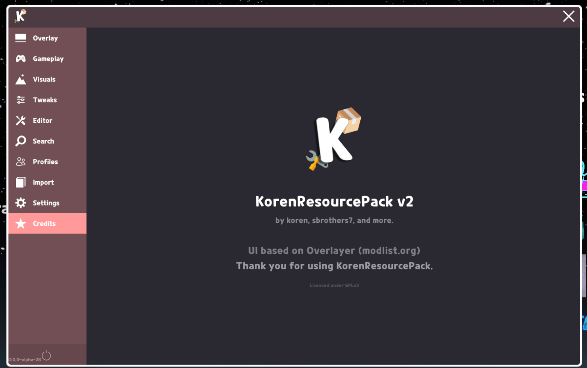
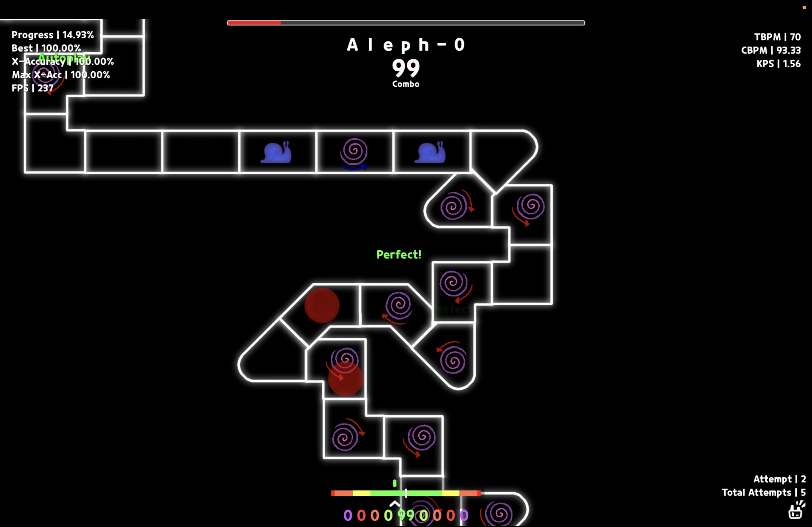

# KorenResourcePack v2

An all-in-one **MelonLoader** mod for **A Dance of Fire and Ice**.

## Install (Recommended)
1. Download [modlist.org app](https://github.com/modlist-org/modlist_org_app/releases/latest) and [KorenResourcePack v2](https://github.com/kkorenn/KorenResourcePack_v2/releases/latest)
2. If not installed MelonLoader yet, install it using the modlist.org app.
2.1. If you are on Mac, you need to do the "Copy Native Launch Options" and put it in steam arguments.
3. Press "Install Mod From File" then select the zip (Koren.zip).
4. Done!

## Install (manual)
0. First make sure you have MelonLoader, (if not follow [Recommended](https://github.com/kkorenn/KorenResourcePack_v2#install-recommended))
1. Download the zip from [releases](https://github.com/kkorenn/KorenResourcePack_v2/releases/latest).
2. Shove it in ur ADoFaI folder. (follow 2.1 if on mac)
2.1. On Mac, it will replace the entire folder instead of just adding the files, manually drag files in.
3. Done!

## Screenshots!!

